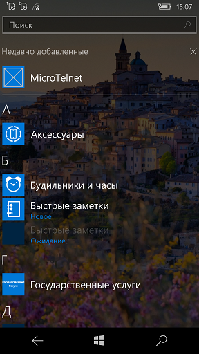
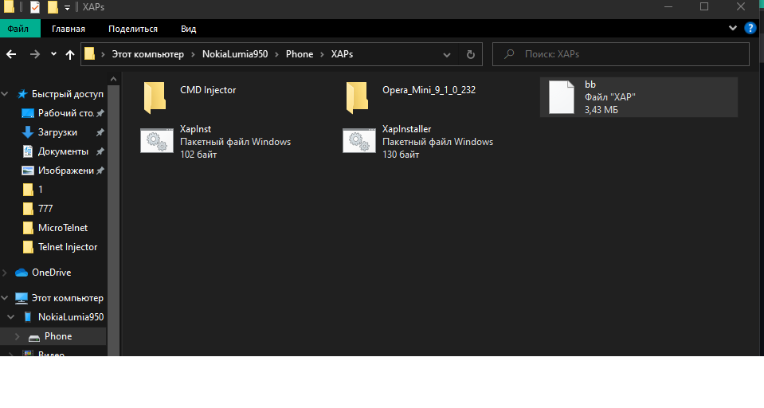
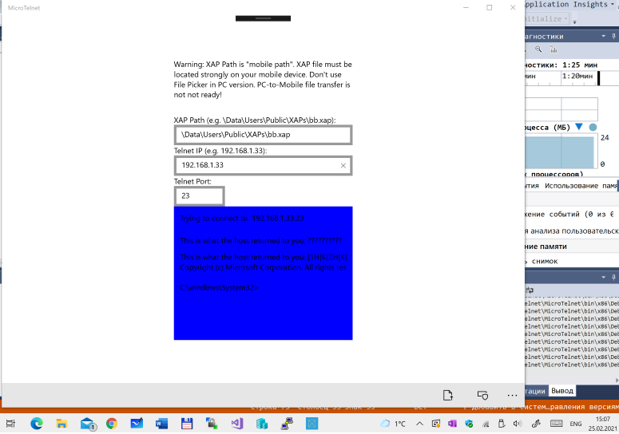
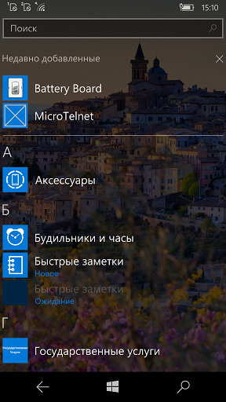

TELNET Injector (Experimental Project for Microsoft Lumia 950)
================================================================

My TELNET Injector "solution" consists of 2 parts:
A. Backend
B. Frontend

Quick notes:
* Use only if You very experienced IT-man!
* Part 1 is moore useful and stable
* Part 2 is very unstable (RnD zone))

A. BACKEND
----------

XapInst.bat  - "Telnet Injector" :)

1) Full interop your W10M phone 
2) Copy xapinst.bat to XAPs folder (full path is \data\users\public\xaps\ , on W10M)
3) Use CMD Injector tech : use Putty and this command:
copy \data\users\public\xaps\xapinst.bat \data\test\bin\

B. FRONTEND
-----------
"Binaries - PC" folder -- assembled installer for your Win10-based PC
"Binaries - WM" folder -- assembled installer for your Win10Mobele-based phone device :)
MicroTelnet folder -- open-sourced UWP app for XAP installation experiments (use it free for your own RnD))

Problems: Mobile version of MicroTelnet cannot connect to localhost :( 
Please, help (if You know Sockets, TCP Clients, etc.).
Github repo here:
 https://github.com/mediaexplorer74/MicroTelnet 
(for feedback, issues discussion, and your pull requests))

Good luck! 

-- MediaExplorer 2021
